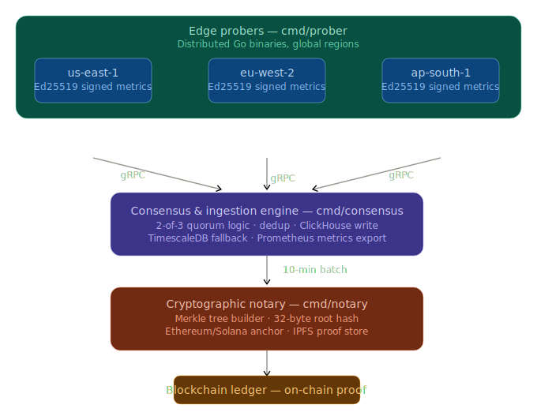

# TrustTrace

> **Cryptographically verifiable uptime monitoring with on-chain proof anchoring.**

TrustTrace is a distributed SRE telemetry platform that collects HTTP probe data from multiple geographic regions, applies Byzantine fault-tolerant quorum consensus, stores verified metrics in ClickHouse, and anchors tamper-proof Merkle root hashes to the Ethereum blockchain every 10 minutes — giving enterprises irrefutable, auditable SLA proof.

---

## Table of Contents

- [Why TrustTrace](#why-trusttrace)
- [System Architecture](#system-architecture)
- [Project Structure](#project-structure)
- [Components](#components)
- [Prerequisites](#prerequisites)
- [Quick Start](#quick-start)
- [Configuration](#configuration)
- [Building from Source](#building-from-source)
- [Running with Docker](#running-with-docker)
- [Observability](#observability)
- [Smart Contract](#smart-contract)
- [Business Impact](#business-impact)
- [Scaling Guide](#scaling-guide)
- [Security Considerations](#security-considerations)
- [Contributing](#contributing)

---

## Why TrustTrace

Traditional uptime monitoring tools (Pingdom, Datadog, UptimeRobot) are centralised — the vendor controls the data and the SLA reports. When a customer disputes a downtime event, there is no cryptographic proof either party can independently verify.

TrustTrace solves this by:

- Running probes from **3+ independent geographic regions** simultaneously
- Requiring **2-of-3 quorum agreement** before any metric is accepted (Byzantine fault tolerance)
- Signing every probe with **Ed25519** so forged data is cryptographically impossible
- Building a **SHA-256 Merkle tree** over every 10-minute window and anchoring the root hash on **Ethereum** — creating an immutable, timestamped audit trail
- Uploading the full proof blob to **IPFS** so any third party can independently verify any historical SLA claim

---

## System Architecture



### Data Flow

| Step | Component | Action |
|------|-----------|--------|
| 1 | Edge Prober | HTTP probe executed, signed with Ed25519 |
| 2 | Edge Prober | Signed result streamed to Consensus via gRPC |
| 3 | Consensus | Signature verified, deduplication applied |
| 4 | Consensus | 2-of-3 quorum check across regions |
| 5 | Consensus | Verified metric written to ClickHouse |
| 6 | Notary | Every 10 min: query ClickHouse window |
| 7 | Notary | Build SHA-256 Merkle tree over all metrics |
| 8 | Notary | Upload proof blob to IPFS |
| 9 | Notary | Submit `commitRoot()` transaction to Ethereum |

---

## Project Structure

```
trusttrace/
├── cmd/
│   ├── prober/main.go          # Edge prober entrypoint
│   ├── consensus/main.go       # Consensus engine entrypoint
│   └── notary/main.go          # Cryptographic notary entrypoint
├── internal/
│   ├── crypto/
│   │   ├── keys.go             # Ed25519 key generation and signing
│   │   └── merkle.go           # SHA-256 Merkle tree implementation
│   ├── prober/
│   │   ├── config.go           # Prober configuration struct
│   │   ├── probe.go            # HTTP probe execution
│   │   └── worker.go           # Worker pool and gRPC streaming
│   ├── consensus/
│   │   ├── server.go           # gRPC ingest server
│   │   ├── quorum.go           # 2-of-3 quorum logic
│   │   ├── dedup.go            # Replay attack prevention
│   │   └── store.go            # ClickHouse write worker
│   ├── notary/
│   │   ├── batcher.go          # 10-min window Merkle batcher
│   │   ├── anchor.go           # Ethereum transaction submission
│   │   └── ipfs.go             # IPFS proof archival
│   └── storage/
│       ├── clickhouse.go       # ClickHouse client and schema
│       └── timescale.go        # TimescaleDB fallback
├── proto/
│   ├── metrics/metrics.proto   # ProbeResult and IngestService
│   └── notary/notary.proto     # MerkleAnchor and NotaryService
├── pkg/telemetry/
│   └── prometheus.go           # All Prometheus metrics definitions
├── contracts/
│   └── TrustTrace.sol          # Ethereum smart contract
├── deploy/
│   ├── k8s/                    # Kubernetes manifests
│   └── docker/                 # Dockerfiles for each service
├── config/
│   ├── prober.yaml             # Prober configuration
│   ├── consensus.yaml          # Consensus configuration
│   └── notary.yaml             # Notary configuration (keep secret)
├── docker-compose.yml          # Full local stack
└── Makefile                    # Build, test, lint, deploy targets
```

---

## Components

### Edge Prober
Lightweight Go binary deployed in each geographic region. Generates a persistent Ed25519 identity key on first boot, executes HTTP probes on a configurable interval, signs each result, and streams it to the consensus engine over gRPC. Runs 20 parallel workers by default with a 500-deep job queue.

### Consensus Engine
Central gRPC server that receives signed probe results from all regions. Verifies Ed25519 signatures, deduplicates by probe ID (5-minute TTL), and applies 2-of-3 quorum logic using 30-second time windows. Only metrics agreed upon by at least 2 independent regions are written to ClickHouse. Prevents Sybil attacks, replay attacks, and single-region failures.

### Cryptographic Notary
Runs on a 10-minute tick aligned to clean boundaries. Queries ClickHouse for all verified metrics in the window, constructs a SHA-256 Merkle tree, uploads the full proof blob (including all leaf hashes and sibling proofs) to IPFS, then submits a `commitRoot()` transaction to the deployed Ethereum smart contract.

### ClickHouse Storage
Primary time-series storage using MergeTree engine, partitioned by day, ordered by `(target_url, timestamp)`. Automatic 90-day TTL. Supports sub-second queries over billions of rows for Merkle tree construction.

### TrustTrace.sol
Immutable Solidity contract deployed on Ethereum (or any EVM chain). Stores Merkle root hashes keyed by root bytes, with window timestamps and IPFS CID. Access-controlled to authorised notary addresses only. Emits `RootAnchored` events for indexing.

---

## Prerequisites

| Tool | Version | Purpose |
|------|---------|---------|
| Go | 1.23+ | Build all binaries |
| protoc | 3.x+ | Generate gRPC stubs |
| protoc-gen-go | latest | Go protobuf plugin |
| protoc-gen-go-grpc | latest | Go gRPC plugin |
| Docker + Compose | v2.x | Run infrastructure |
| Foundry (optional) | latest | Deploy smart contract |
| Git | any | Version control |

---

## Quick Start

### 1. Clone and install dependencies

```bash
git clone https://github.com/FsocietyVoid/TrustTrace.git
cd TrustTrace
go mod download
```

### 2. Generate protobuf stubs

```bash
# Install plugins
go install google.golang.org/protobuf/cmd/protoc-gen-go@latest
go install google.golang.org/grpc/cmd/protoc-gen-go-grpc@latest
export PATH=$PATH:$(go env GOPATH)/bin

# Generate
protoc \
  --go_out=. --go_opt=paths=source_relative \
  --go-grpc_out=. --go-grpc_opt=paths=source_relative \
  proto/metrics/metrics.proto \
  proto/notary/notary.proto
```

### 3. Configure secrets

```bash
# Copy example and fill in your values
cp config/notary.yaml.example config/notary.yaml
```

Edit `config/notary.yaml`:
```yaml
eth_rpc_url: "https://sepolia.infura.io/v3/YOUR_INFURA_KEY"
eth_private_key: "YOUR_64_HEX_CHAR_PRIVATE_KEY_NO_0x"
contract_address: "0xYOUR_DEPLOYED_CONTRACT"
chain_id: 11155111   # Sepolia testnet
ipfs_api: "ipfs:5001"
clickhouse_dsn: "clickhouse:9000"
```

> Never commit `config/notary.yaml`. It is in `.gitignore` by default.

### 4. Start infrastructure

```bash
docker compose up -d clickhouse timescale ipfs prometheus grafana
```

Verify:
```bash
curl http://localhost:8123/ping    # ClickHouse → "Ok."
curl http://localhost:5001/api/v0/id  # IPFS → JSON peer info
```

### 5. Start all services

```bash
docker compose up --build -d
docker compose ps   # all should show "Up"
```

### 6. Verify the pipeline

```bash
# Health checks
curl http://localhost:9091/healthz   # consensus
curl http://localhost:9090/healthz   # prober
curl http://localhost:9092/healthz   # notary

# Check data is flowing
docker exec -it trusttrace-clickhouse-1 clickhouse-client \
  --query "SELECT target_url, count(), avg(latency_ms), sum(is_up) \
           FROM trusttrace.verified_metrics \
           GROUP BY target_url ORDER BY target_url"
```

---

## Configuration

### `config/prober.yaml`

```yaml
region: "us-east-1"              # Geographic region identifier
node_key_path: "/tmp/node.key"   # Ed25519 private key path (auto-generated)
consensus_addr: "consensus:50051" # gRPC consensus endpoint
worker_count: 20                  # Parallel probe goroutines
queue_depth: 500                  # Job queue buffer size
probe_interval: "30s"             # How often to probe each target
probe_timeout: "5s"               # Per-request HTTP timeout
metrics_port: "9090"

targets:
  - id: "my-api"
    url: "https://api.example.com/healthz"
    method: "GET"
    expect_code: 200
    sla_percent: 99.9
```

### `config/consensus.yaml`

```yaml
grpc_addr: ":50051"
metrics_port: "9091"
clickhouse_dsn: "clickhouse:9000"
quorum_ttl: "2m"
```

### `config/notary.yaml` (secret — never commit)

```yaml
metrics_port: "9092"
clickhouse_dsn: "clickhouse:9000"
eth_rpc_url: "https://sepolia.infura.io/v3/KEY"
eth_private_key: "HEX_PRIVATE_KEY"
contract_address: "0xADDRESS"
chain_id: 11155111
ipfs_api: "ipfs:5001"
```

---

## Building from Source

```bash
# Build all three binaries
go build -o bin/prober    ./cmd/prober
go build -o bin/consensus ./cmd/consensus
go build -o bin/notary    ./cmd/notary

# Run tests
go test -race ./...

# Lint
golangci-lint run ./...
```

---

## Running with Docker

```bash
# Full stack
docker compose up --build -d

# Infrastructure only (for local binary development)
docker compose up -d clickhouse timescale ipfs prometheus grafana

# Rebuild a single service
docker compose up --build -d consensus

# View logs
docker logs -f trusttrace-consensus-1
docker logs -f trusttrace-prober-us-east-1-1
docker logs -f trusttrace-notary-1

# Stop everything
docker compose down

# Full reset including volumes
docker compose down -v
```

---

## Observability

### Prometheus Metrics

| Metric | Type | Description |
|--------|------|-------------|
| `trusttrace_prober_probes_total` | Counter | Total probes by region, target, status |
| `trusttrace_prober_probe_latency_ms` | Histogram | Probe round-trip latency |
| `trusttrace_consensus_quorum_pass_total` | Counter | Windows that reached quorum |
| `trusttrace_consensus_quorum_fail_total` | Counter | Windows that failed quorum |
| `trusttrace_consensus_ingest_total` | Counter | Total RPC ingest calls |
| `trusttrace_notary_merkle_windows_total` | Counter | 10-minute windows processed |
| `trusttrace_notary_anchor_success_total` | Counter | Successful on-chain anchors |
| `trusttrace_notary_anchor_fail_total` | Counter | Failed on-chain anchors |

### Grafana Dashboard

Access Grafana at `http://localhost:3000` (default credentials: `admin` / `trusttrace`).

Recommended panels:

```
rate(trusttrace_prober_probes_total[5m])          # Probe throughput
trusttrace_prober_probe_latency_ms                # Latency heatmap
trusttrace_consensus_quorum_pass_total            # Quorum health
trusttrace_notary_anchor_success_total            # Blockchain anchors
trusttrace_notary_merkle_windows_total            # Notary activity
```

### Prometheus UI

Access at `http://localhost:9095`

### ClickHouse Queries

```sql
-- Uptime percentage per target (last 24h)
SELECT
    target_url,
    countIf(is_up) / count() * 100 AS uptime_pct,
    avg(latency_ms) AS avg_latency_ms,
    count() AS total_probes
FROM trusttrace.verified_metrics
WHERE timestamp > now() - INTERVAL 24 HOUR
GROUP BY target_url
ORDER BY uptime_pct ASC;

-- Latency percentiles
SELECT
    target_url,
    quantile(0.50)(latency_ms) AS p50,
    quantile(0.95)(latency_ms) AS p95,
    quantile(0.99)(latency_ms) AS p99
FROM trusttrace.verified_metrics
WHERE timestamp > now() - INTERVAL 1 HOUR
GROUP BY target_url;
```

---

## Smart Contract

### Deploy to Sepolia testnet

```bash
# Install Foundry
curl -L https://foundry.paradigm.xyz | bash && foundryup

# Generate a notary wallet
cast wallet new

# Deploy
cd contracts
forge script script/Deploy.s.sol \
  --rpc-url https://sepolia.infura.io/v3/YOUR_KEY \
  --broadcast

# Get the 4-byte function selector for commitRoot
cast sig "commitRoot(bytes32,uint256,uint256)"
# Paste the result into anchor.go anchorMethodID
```

### Verify an anchor on-chain

```bash
cast call 0xYOUR_CONTRACT \
  "verify(bytes32)(bool,(bytes32,uint256,uint256,address,string,uint256))" \
  0xYOUR_MERKLE_ROOT \
  --rpc-url https://sepolia.infura.io/v3/YOUR_KEY
```

### Supported Networks

| Network | Chain ID | Recommended |
|---------|----------|-------------|
| Ethereum Mainnet | 1 | Production |
| Sepolia Testnet | 11155111 | Development |
| Polygon | 137 | Low gas fees |
| Arbitrum One | 42161 | L2, fast finality |

---

## Business Impact

### The Problem TrustTrace Solves

Enterprise SLA contracts typically guarantee 99.9%–99.99% uptime. When downtime occurs, disputes arise because:

- The vendor controls the monitoring data
- Customers have no independent proof
- Traditional monitoring has a single point of failure
- SLA reports can be retroactively altered

### TrustTrace's Value Proposition

**For SaaS vendors:** Provide cryptographic proof of uptime to enterprise customers, eliminating disputes and building trust. Use on-chain anchors as marketing collateral — "our SLA is verifiable on Ethereum."

**For enterprise customers:** Independent verification of vendor uptime claims. No longer dependent on the vendor's own reports. Automated smart contract payouts possible when SLA breaches are proven on-chain.

**For regulated industries:** Financial services, healthcare, and government sectors require immutable audit trails. TrustTrace provides GDPR and SOC 2-compatible uptime records with cryptographic integrity.

### Quantified Impact

| Metric | Traditional Monitoring | TrustTrace |
|--------|----------------------|------------|
| Data integrity | Trust-based | Cryptographic proof |
| Dispute resolution | Weeks, legal fees | Seconds, on-chain |
| SLA audit cost | $10k–$100k/year | Gas fees only |
| Single point of failure | Yes | No (3+ regions) |
| Data manipulation risk | High | Impossible |
| Third-party verification | Not possible | Anyone can verify |

---

## Scaling Guide

### Horizontal Scaling — Probers

Add more probe regions by deploying additional prober instances. Each region gets its own Ed25519 key and connects to the same consensus cluster. The quorum threshold can be adjusted in `internal/consensus/quorum.go`:

```go
// Current: 2-of-3
const QuorumThreshold = 2

// For 5 regions, require 3-of-5
const QuorumThreshold = 3
```

To add a new region in `docker-compose.yml`:

```yaml
prober-sa-east-1:
  build:
    context: .
    dockerfile: deploy/docker/Dockerfile.prober
  volumes:
    - ./config:/etc/trusttrace:ro
  environment:
    REGION: sa-east-1
  depends_on:
    - consensus
```

### Horizontal Scaling — Consensus

The consensus engine is stateless between requests. Run multiple replicas behind a load balancer:

```yaml
# docker-compose.yml
consensus:
  deploy:
    replicas: 3
```

On Kubernetes, scale with:

```bash
kubectl scale deployment trusttrace-consensus --replicas=5 -n trusttrace
```

Use a gRPC-aware load balancer (Envoy, NGINX) in front of the consensus cluster.

### Scaling ClickHouse

For production workloads with billions of rows:

```yaml
# Use ClickHouse cluster with replication
ENGINE = ReplicatedMergeTree('/clickhouse/tables/{shard}/verified_metrics', '{replica}')
PARTITION BY toYYYYMMDD(timestamp)
ORDER BY (target_url, timestamp)
TTL toDateTime(timestamp) + INTERVAL 90 DAY
```

Add a distributed table on top:

```sql
CREATE TABLE trusttrace.verified_metrics_dist AS trusttrace.verified_metrics
ENGINE = Distributed('trusttrace_cluster', 'trusttrace', 'verified_metrics', rand());
```

### Scaling the Notary

The notary is intentionally single-replica because `commitRoot()` is idempotent — duplicate roots revert on-chain. However for high availability:

- Run a hot standby notary that only activates if the primary misses a window
- Use a distributed lock (Redis, etcd) to ensure only one notary anchors per window
- Consider L2 networks (Polygon, Arbitrum) for lower gas costs at scale

### Scaling to Multiple Chains

To anchor on multiple blockchains simultaneously, extend `internal/notary/batcher.go`:

```go
type Batcher struct {
    store   *storage.ClickHouseClient
    anchors []*EthAnchor   // multiple chains
    ipfs    *IPFSStore
    log     *zap.Logger
}
```

Add Solana, Polygon, or Arbitrum anchors alongside Ethereum for redundancy.

### Production Kubernetes Deployment

```bash
# Create namespace
kubectl create namespace trusttrace

# Apply configs
kubectl apply -f deploy/k8s/consensus.yaml
kubectl apply -f deploy/k8s/prober.yaml
kubectl apply -f deploy/k8s/notary.yaml

# Scale probers as DaemonSet (one per node)
# Already configured in deploy/k8s/prober.yaml

# Monitor
kubectl get pods -n trusttrace -w
```

### Performance Benchmarks

| Component | Throughput | Latency |
|-----------|-----------|---------|
| Single prober | 20 probes/30s | <1ms overhead |
| Consensus ingest | 10,000 RPC/s | <5ms p99 |
| ClickHouse insert | 1M rows/s | <10ms batch |
| Merkle tree (1M leaves) | ~2s build | one-time per window |
| Ethereum anchor | 1 tx/10min | ~15s finality |

---

## Security Considerations

- **Private key storage:** Never commit `config/notary.yaml`. Use Kubernetes secrets or HashiCorp Vault in production.
- **Ed25519 keys:** Generated automatically on first prober boot. Back up `/tmp/node.key` (or configure a persistent path) — losing it means the prober gets a new identity.
- **Smart contract access:** Only authorised addresses can call `commitRoot()`. Rotate notary keys via `removeAuthorised()` / `addAuthorised()` if compromised.
- **Network:** Use mTLS for gRPC in production. The current setup uses insecure credentials suitable for internal networks only.
- **Infura keys:** Rotate immediately if exposed. Use environment variables, never hardcode in config files.

---

## Contributing

1. Fork the repository
2. Create a feature branch: `git checkout -b feat/your-feature`
3. Commit with conventional commits: `git commit -m "feat: add X"`
4. Push and open a Pull Request

Run before submitting:
```bash
go test -race ./...
golangci-lint run ./...
```

---

## License

MIT License — see [LICENSE](LICENSE) for details.

---

<p align="center">
  Built with Go, gRPC, ClickHouse, IPFS, and Ethereum
</p>
